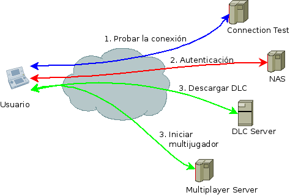

*Aquí describiré algunos protocolos de comunucaciones junto a un estudio de seguridad.*

# Esquema de comunicación
El objetivo de la comunicación inalámbrica tiene dos variantes.
* Ofrecer contenidos extras descargables (DLC).
* Ofrecer capacidad de multijugador con otros usuarios.

En ambos casos, el esquema general es el siguiente. En apartados sucesivos
se detallará en detalle cada uno de estos procesos.

1. En primer lugar la consola realiza una prueba de conexión contactando
con un servidor.
2. Una vez verificada la conexión, se autentica contactando con un servidor
de acceso (NAS).
3. Finalmente, se dirige al servidor que ofrezca el servicio deseado:
DLC o multijugador.

# Recursos
El tráfico estudiado fue capturado en abril del año pasado y se puede encontrar
en la siguiente [Google Drive](https://drive.google.com/open?id=0B1_3wfijTAJ7T1RIOE9lTUl4bHc&authuser=0)
Además, existe tráfico para otros juegos de la Nintendo DS y Wii
en [Save Nintendo Wi-Fi](http://save-nintendo-wifi.com/).
